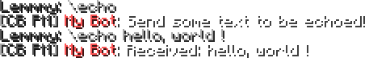

# ComputerCraft API

## License registration

* If you want to send messages to players from your chatbox, you'll need to register a license key. You can
  do this with the in-game command: `/chatbox license register`.
* Add the license key to the computer by running `chatbox register <key>` - you can **click to copy** in-game.
* Otherwise, to set the computer as a chatbox computer as a guest (can receive but not send messages and events), run `chatbox register guest`.
* You can now use the global `chatbox` API and receive events from the server!

## Basic chat logger program

This is an example program that will log public messages, and print them to the terminal:

```lua
while true do
	local event, user, message, data = os.pullEvent("chat_ingame")

	print(string.format("<%s> %s", user, message))
end
```

## Basic command-based chatbot

This is an example chatbot that uses backslash commands (`\commands`), and responds to the user privately with
`chatbox.tell`. The bot responds to the command `\echo`, with whatever text the user sent it.

**This will require the license to be registered with `/chatbox license register` and added to the computer with `chatbox register`.**

```lua
if not chatbox.hasCapability("command") or not chatbox.hasCapability("tell") then
	error("Chatbox does not have the required permissions. Did you register the license?")
end

local BOT_NAME = "&cMy Bot" -- You can colour bot names!

while true do
	local event, user, command, args = os.pullEvent("command")

	if command == "echo" then
		if #args > 0 then
			chatbox.tell(user, "Received: " .. table.concat(args, " "), BOT_NAME)
		else
			chatbox.tell(user, "Send some text to be echoed!", BOT_NAME)
		end
	end
end
```



## Events

### In-game chat event

The event received when a player posts a message in public chat.

| Name      | Argument Description                                                                      |
| --------- | ----------------------------------------------------------------------------------------- |
| `event`   | `"chat_ingame"`                                                                           |
| `user`    | The username of the user that sent this message (or their UUID if they don't have a name) |
| `message` | The full raw text of their message (including markdown characters)                        |
| `data`    | Table containing the full [Event packet](websocket.md#in-game-chat-event)                 |

### Discord chat event

The event received when a player posts a message in [Discord](https://discord.com/invite/AfmU7qKeVT).

| Name      | Argument Description                                                                                                                     |
| --------- | ---------------------------------------------------------------------------------------------------------------------------------------- |
| `event`   | `"chat_discord"`                                                                                                                         |
| `user`    | The username and discriminator (e.g. `Lemmmy#8924`) of the user that sent this message (or their Snowflake ID if they don't have a name) |
| `message` | The full raw text of their message (including markdown characters)                                                                       |
| `data`    | Table containing the full [Event packet](websocket.md#discord-chat-event)                                                                |


### Chatbox chat event

{: .warning }
> Not yet implemented

The event received when another chatbox sends a message.

| Name      | Argument Description                                                                      |
| --------- | ----------------------------------------------------------------------------------------- |
| `event`   | `"chat_chatbox"`                                                                          |
| `name`    | The name of the chatbox                                                                   |
| `user`    | The username of the user that owns this chatbox (or their UUID if they don't have a name) |
| `message` | The full raw text of their message (including markdown or formatting characters)          |
| `data`    | Table containing the full [Event packet](websocket.md#chatbox-chat-event)                 |

### Command event

The event received when a player runs a backslash command (`\command`) in-game.

| Name      | Argument Description                                                                           |
| --------- | ---------------------------------------------------------------------------------------------- |
| `event`   | `"command"`                                                                                    |
| `user`    | The username of the user that owns this chatbox (or their UUID if they don't have a name)      |
| `command` | The command the user ran                                                                       |
| `args`    | A table containing the space-separated arguments of the command (excluding the command itself) |
| `data`    | Table containing the full [Event packet](websocket.md#command-event)                           |

### Join event

The event received when a player joins the game.

| Name    | Argument Description                                                           |
| ------- | ------------------------------------------------------------------------------ |
| `event` | `"join"`                                                                       |
| `user`  | The username of the user that joined (or their UUID if they don't have a name) |
| `data`  | Table containing the full [Event packet](websocket.md#join-event)              |

### Leave event

The event received when a player leaves the game.

| Name    | Argument Description                                                         |
| ------- | ---------------------------------------------------------------------------- |
| `event` | `"leave"`                                                                    |
| `user`  | The username of the user that left (or their UUID if they don't have a name) |
| `data`  | Table containing the full [Event packet](websocket.md#leave-event)           |

### Death event

The event received when a player dies in-game.

| Name     | Argument Description                                                         |
| -------- | ---------------------------------------------------------------------------- |
| `event`  | `"death"`                                                                    |
| `user`   | The username of the user that died (or their UUID if they don't have a name) |
| `source` | The name (or UUID) of the thing that killed the player, or `nil`             |
| `text`   | The text of the death message                                                |
| `data`   | Table containing the full [Event packet](websocket.md#death-event)           |

### World change event

The event received when a player changes worlds.

| Name          | Argument Description                                                      |
| ------------- | ------------------------------------------------------------------------- |
| `event`       | `"world_change"`                                                          |
| `user`        | The username of the user that changed worlds.                             |
| `origin`      | The identifier string of the world the user has moved from.               |
| `destination` | The identifier string of the world the user is now in.                    |
| `data`        | Table containing the full [Event packet](websocket.md#world-change-event) |

### AFK event

{: .warning }
> Not yet implemented

The event received when a player goes AFK in-game.

| Name    | Argument Description                                                             |
| ------- | -------------------------------------------------------------------------------- |
| `event` | `"afk"`                                                                          |
| `user`  | The username of the user that went AFK (or their UUID if they don't have a name) |
| `data`  | Table containing the full [Event packet](websocket.md#afk-event)                 |

### AFK return event

{: .warning }
> Not yet implemented

The event received when a player returns from being AFK in-game.

| Name    | Argument Description                                                             |
| ------- | -------------------------------------------------------------------------------- |
| `event` | `"afk_return"`                                                                   |
| `user`  | The username of the user that went AFK (or their UUID if they don't have a name) |
| `data`  | Table containing the full [Event packet](websocket.md#afk-return-event)          |

### Server restart scheduled event

{: .warning }
> Not yet implemented

The event received when a server restart has been scheduled.

If a server restart was scheduled before the websocket connected, then the `server_restart_scheduled` event will be
sent after the chatbox API has connected. In this case, `restartSeconds` will not be the time until the restart, but 
instead the time that was initially specified for the restart. If the precise restart time is required, it can be
accessed via the `restartAt` field (ISO-8601) of the `data` table, which contains the full 
[Event packet](websocket.md#server-restart-scheduled-event).

| Name      | Argument Description                                                                  |
| --------- | ------------------------------------------------------------------------------------- |
| `event`   | `"server_restart_scheduled"`                                                          |
| `type`    | The type of restart. Will be `"automatic"` or `"manual"`.                             |
| `seconds` | The number of seconds specified until the restart.                                    |
| `data`    | Table containing the full [Event packet](websocket.md#server-restart-scheduled-event) |

### Server restart cancelled event

{: .warning }
> Not yet implemented

The event received when a previously scheduled server restart has now been cancelled.

| Name    | Argument Description                                                                  |
| ------- | ------------------------------------------------------------------------------------- |
| `event` | `"server_restart_cancelled"`                                                          |
| `type`  | The type of restart. Will be `"automatic"` or `"manual"`.                             |
| `data`  | Table containing the full [Event packet](websocket.md#server-restart-cancelled-event) |

## Functions

### chatbox.say(text, name, mode)

Sends a message to public chat.
You'll need explicit permission from a member of staff to get this capability.

{: .warning }
> This requires your license to have the `say` capability, which most do not.

You can use these formatting modes:

* `markdown` - Discord-like markdown formatting. Supports URLs, but not colours.
* `format` - Minecraft-like formatting strings (e.g. `&e` for yellow). Supports colours, but not URLs.
* `minimessage` - HTML-like formatting strings (e.g. `<yellow></yellow>` for yellow). Supports colours and hover events.

| Name   | Argument Description                                                                                                |
| ------ | ------------------------------------------------------------------------------------------------------------------- |
| `text` | The message to send to chat                                                                                         |
| `name` | *(optional)* The name of this chatbox (shows in the name tag)                                                       |
| `mode` | *(optional)* The text formatting mode to use. Must be `markdown`, `format` or `minimessage`. Defaults to `markdown` |

### chatbox.tell(user, text, name, mode)

Sends a private message to a user. **Note:** this requires you to register a chatbox license with
`/chatbox license register`.

You can use these formatting modes:

* `markdown` - Discord-like markdown formatting. Supports URLs, but not colours.
* `format` - Minecraft-like formatting strings (e.g. `&e` for yellow). Supports colours, but not URLs.
* `minimessage` - HTML-like formatting strings (e.g. `<yellow></yellow>` for yellow). Supports colours and hover events.

| Name   | Argument Description                                                                                                |
| ------ | ------------------------------------------------------------------------------------------------------------------- |
| `user` | The username of the user to send a message to                                                                       |
| `text` | The message to send to chat                                                                                         |
| `name` | *(optional)* The name of this chatbox (shows in the name tag)                                                       |
| `mode` | *(optional)* The text formatting mode to use. Must be `markdown`, `format` or `minimessage`. Defaults to `markdown` |

### chatbox.getPlayers()

Returns a table of [user objects](websocket.md#user-object) that are currently online in-game.

### chatbox.getPlayerList()

Returns a list of player usernames that are currently online in-game. You should probably use
[`chatbox.getPlayers()`](#chatboxgetplayers) instead.

### chatbox.hasCapability(capability)

Checks if the chatbox license has the specified capability. Valid capabilities:

| Capability | Defaults          | Description                                                                                  |
| ---------- | ----------------- | -------------------------------------------------------------------------------------------- |
| `read`     | Guest, registered | Read messages from in-game chat and Discord, and receive events such as joining and leaving. |
| `command`  | Registered        | Receive in-game backslash commands.                                                          |
| `tell`     | Registered        | Send private messages to individual players.                                                 |
| `say`      | *None*            | Send public messages to the whole in-game chat.                                              |

### chatbox.getLicenseOwner()

Returns the username and [user object](websocket.md#user-object) of the player that owns this chatbox license.


### chatbox.isConnected()

Returns whether the chatbox is connected to the API.

### chatbox.isGuest()

Returns whether the chatbox is connected with the guest license.