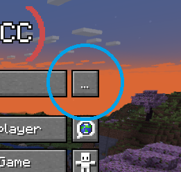

import { Aside } from '@astrojs/starlight/components';

<Aside>We recommend you use the proxy selection UI shipped in the pack in order to select a proxy. Press the "P" Button to the left of `Play ReconnectedCC`</Aside>

We have a few proxies available seperate from the standard IP if you're unable to join or if the connection is unstable through the primary IP address (`play.reconnected.cc`)

- `play.reconnected.cc` - Our main server hosted in Helsinki, Finland.
- `as-us.reconnected.cc` - A proxy hosted in Ashburn, USA
- `by-de.reconnected.cc` - A proxy hosted in Falkenstein, Germany using Hetzner. 

To add and use an unlisted proxy, press the three dots next to the `Play ReconnectedCC` button to open the multiplayer UI

Then add the proxy as you would a regular server.

## Raknet

If you're having trouble connecting to the server, you can try using the Raknet protocol. This is a different protocol that can sometimes help with connection issues.
Raknet might cause issues with the way monitors display and interact, and it is not the preferred connection method because of this.
To use it, add the server with the following address: `raknet;play.reconnected.cc`.