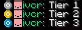

# Becoming a Supporter

You can donate by clicking the "Support Us!" button on our [website](https://reconnected.cc) and agreeing to the terms.
You will be sent to a Stripe checkout page and your supporter perks will be given to you automatically. 

If you havent received your supporter perks within 30 minutes, please contact the staff team.

## Perks

You will receive a colored prefix to indicate your supporter tier.

Your tier is decided by the *total* amount of money you have ever donated to ReconnectedCC. From €25, you gain tier 2, and from €75 you gain tier 3.

You can run /fly in the lobby, and use /hat and /sleep everywhere

Please note that more supporter perks are on the way.

## Commands

You can use the following commands to customise your Supporter status:

| Command                 | Description                                                                                           |
| ----------------------- | ----------------------------------------------------------------------------------------------------- |
| `/supporter optin`      | Shows your prefix                                                                                     |
| `/supporter optout`     | Hides your prefix                                                                                     |
| `/supporter tier <1-3>` | Changes the prefix to reflect a different tier equal to your current tier or under your current tier. |
