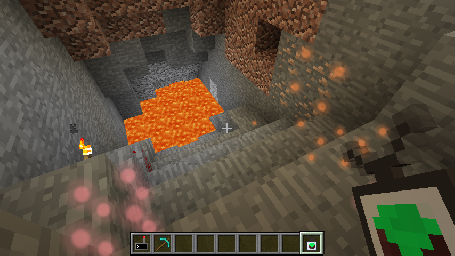

The block scanner provides a way to query information about surrounding blocks. Useful for discovering ores, or just snooping in on your neighbours.

**Module: `plethora:scanner` ([view methods](https://plethora.madefor.cc/methods.html#module-methods-plethora:scanner))**

Usable in:

- Manipulator

- Minecart computer

- Neural interface

- Pocket computer

- Turtle




## Basic usage
The easiest way to start using the block scanner is, well, with the .scan() method. This looks at every block in an 8 block radius (17x17x17 centred on the scanner) and returns some basic information about it. The easiest way to extract information out of this is just to loop over it:

```lua
local scanner = peripheral.wrap(--[[ whatever ]])
for _, block in pairs(scanner.scan()) do
  print(("The block at %d, %d, %d is %s"):format(block.x, block.y, block.z, block.name))
end
```
If you’re just looking for a couple of blocks though, it may be easier to index directly into the list. This is possible, though takes some thinking about. I’ll save you the hassle though, and just provide some code:

```lua
local scanner_radius = 8
local scanner_width = scanner_radius * 2 + 1

local scanned = scanner.scan()
local function scanned_at(x, y, z)
  return scanned[scanner_width ^ 2 * (x + scanner_radius) + scanner_width * (y + scanner_radius) + (z + scanner_radius) + 1]
end
While it’s useful to know what block something is, there may be times you want to query a little more information. Maybe find out the energy levels of every energy cell within range? This is where .getBlockMeta comes in. This takes some coordinate relative to the scanner and returns all the information it knows about it - just like you’d called .getMetadata on the peripheral!

local meta = scanner.getBlockMeta(0, 3, 0) -- Get information about whatever is 3 blocks above
print(textutils.serialise(meta))
```

## Other functionality
The block scanner can also be held in your hand to reveal all ores within the scanner’s radius. It doesn’t serve much use, but looks kinda pretty.

Hunting for blue shiny rocks with the block scanner

## Configuring
The block scanner can be configured using the scanner category of the plethora.cfg file:

`radius=8`: The maximum distance that a scaner can query. Note that the area is a cube, not a sphere.
