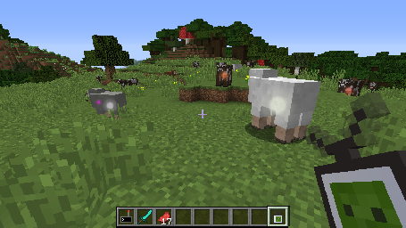

The entity sensor provides a way to query information about surrounding entities. There are so many ways this could go wrong…

**Module: `plethora:sensor` ([view methods](https://plethora.madefor.cc/methods.html#module-methods-plethora:sensor))**

Usable in:

- Manipulator

- Minecart computer

- Neural interface

- Pocket computer

- Turtle



## Basic usage
The entity sensor provides many nifty methods, but .sense() is definitely the one to get started with. After all, it’s what the sensor does best! This finds all entities within sensor range (taxicab distance) and reports some very basic information about them.
```lua
local sensor = peripheral.wrap(--[[ whatever ]])
for _, entity in pairs(sensor.sense()) do
  print(("We found an entity (name: %s, uuid: %s)"):format(entity.name, entity.id))
end
If you want to find some more information about an entity (maybe you want to find out how hungry your friends are), you can use .getMetaByID and .getMetaByName. The first of these is a little more general, at the cost of being slightly more confusing. .getMetaByID takes an entity’s UUID and returns lots of metadata about it. This ID can be found with the above .sense method, though beware - it’s possible the entity may have wandered off and thus no longer be within range.

local entities = sensor.sense()
if #entities > 0 then
  local meta = sensor.getMetaByID(entities[1].id)
  if meta then print(textutils.serialise(meta)) end
end
```
`.getMetaByName` does much the same, but only operates on players, taking a username instead.

## Upgrading
By default, the sensor has a range of 16 blocks (Level 0). The maximum range is 32 blocks (Level 5). Crafting the sensor with a Nether Star and Netherite Ingot will increase the range. Note that this does not scale linearly; the upgrade levels are as follows:
- Level 0 = 16 blocks (default)
- Level 1 = 24 blocks (+8)
- Level 2 = 28 blocks (+4)
- Level 3 = 30 blocks (+2)
- Level 4 = 31 blocks (+1)
- Level 5 = 32 blocks (+1)

## Other functionality
Holding the entity sensor will display an orb on every nearby entity. This provides a nice way of hunting down those pesky zombies!
