import { Aside } from '@astrojs/starlight/components';

[sc-goodies](https://github.com/SwitchCraftCC/sc-goodies) is a Fabric 1.20 content mod for the SwitchCraft server. It
contains a variety of features specifically designed for SwitchCraft, many of which were inspired by previous 1.12 mods
on SwitchCraft 2 such as cpw's [ironchest](https://github.com/cpw/ironchest), ChickenBones'
[EnderStorage](https://github.com/TheCBProject/EnderStorage), and Vazkii's [Quark](https://github.com/VazkiiMods/Quark).
It has been ported to Fabric 1.21 for this server

## Useful links

- [sc-goodies on GitHub](https://github.com/reconnectedcc/sc-goodies)

## Iron Storage

Higher-capacity variants of chests, barrels, and shulker boxes are added to the game:

<ul>
  <li>
    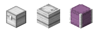
    Iron - 54 slots (9x6)
  </li>
  <li>
    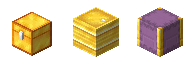
    Gold - 81 slots (9x9)
  </li>
  <li>
    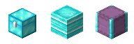
    Diamond - 108 slots (12x9)
  </li>
</ul>

Upgrades between variants can be crafted as well. For example, an iron chest can be upgraded to a gold chest by crafting
an Iron to Gold Storage Upgrade, and shift+right-clicking the chest with it. The upgrades work for chests, barrels, and
shulker boxes.

<ul>
  <li>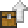 Vanilla to Iron Storage Upgrade</li>
  <li> Iron to Gold Storage Upgrade</li>
  <li>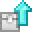 Iron to Diamond Storage Upgrade</li>
  <li>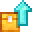 Gold to Diamond Storage Upgrade</li>
</ul>

Iron Chests do not become double chests - they are always single chests. Otherwise, these upgraded storage variants
behave identically to their vanilla counterparts. Hoppers and comparators can be used, shulker boxes can be dyed, and
all can be wrapped as ComputerCraft peripherals.

### Barrel Hammer
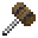

Chests can be converted to barrels (and vice-versa) by shift+right-clicking them with a barrel hammer. This makes it
easy to convert storage types while still keeping all items inside. The Barrel Hammer has a durability of 64 and can be
repaired with an iron ingot.

## Ender Storage
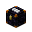

Ender Storage allows players to store their items in a special chest that features a changeable color coded frequency.
Any chest with the same frequency will share inventory, enabling item transfer over any distance and even across
dimensions. The frequency can be changed by right-clicking the three slots on top of the chest with a dye. As there are
16 colors, there are 4096 possible frequencies.

You can also change the frequencies and personal status of an Ender Storage with [crafting recipes](#crafting-recipes).

### Personal frequencies

If a player right-clicks the handle of the Ender Storage with a Diamond, it becomes a
Personal Ender Storage chest. The contents of this chest are unique to the player who placed the diamond, and only that
player can change its frequency. The diamond can be recovered by shift+right-clicking the chest with an empty hand.

For security reasons, the frequency of a Personal Ender Storage chest cannot be changed by ComputerCraft by default. To
allow this behavior, right-click the handle of the chest with an Emerald. This will
enable ComputerCraft to change the frequency of the chest.

<Aside type="danger">
If you use an emerald on a Personal Ender Storage chest, **any** player with physical access to the chest will be able to access **all** of your private frequencies. Take care with who you give Personal Ender Storage chests to, and who you trust in your claims.
</Aside>

<Aside>
Public (non-personal) Ender Storage chests do not need an emerald to be changed by ComputerCraft.
</Aside>

### Crafting recipes

When placing any Ender Storage in a crafting grid, you can change its frequency and personal status:

- Place three dyes in the top row of a crafting grid, and the Ender Storage in any slot, to change the frequency.
- Place a diamond in any slot to make the chest personal. The owner will be the player performing the crafting
  operation, so if the player isn't available for some reason (e.g. automated crafting in some conditions), this recipe
  will not work. The diamond will not be consumed.
- Place an emerald in any slot to make the chest allow ComputerCraft to change its frequency. This also implies the
  chest is personal. The emerald will not be consumed.

All three of these can be combined in a single crafting operation.

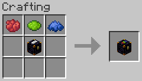

## Peripheral API - Ender Storage

An Ender Storage Chest can be wrapped as a peripheral with the name `ender_storage`, e.g.:

```lua
local enderStorage = peripheral.wrap("ender_storage")
```

### `enderStorage.getFrequency(): number, number, number`

Returns the current frequency of the chest. The numbers returned are equivalent to the ComputerCraft
[`colors` API](https://tweaked.cc/module/colors.html).

### `enderStorage.getOwner(): string, string`

If the chest is a Personal Ender Storage chest, returns the UUID of the player who owns the chest, and their last-known
username. If the chest is not a Personal Ender Storage chest, returns `nil, nil`.

### `enderStorage.isPersonal(): boolean`

Returns `true` if the chest is a Personal Ender Storage chest, `false` otherwise.

### `enderStorage.areComputerChangesEnabled(): boolean`

Returns `true` if the chest allows ComputerCraft to change its frequency, `false` otherwise. This will always be `true`
for non-personal Ender Storage chests. For Personal Ender Storage chests, this will be `true` if an emerald has been
used on the chest's handle.

### `enderStorage.setFrequency(left: number, middle: number, right: number)`

Sets the frequency of the chest. The numbers passed are equivalent to the ComputerCraft
[`colors` API](https://tweaked.cc/module/colors.html). For example, to set the frequency to white, white, white:

```lua
enderStorage.setFrequency(colors.white, colors.white, colors.white)
```

### `enderStorage.getName(): string`

Returns the custom name of the chest's frequency, if it has one, or `nil` otherwise.

### `enderStorage.getDescription(): string`

Returns the custom description of the chest's frequency, if it has one, or `nil` otherwise.

## Hover Boots


Hover Boots allow players to jump higher, walk up one-block high walls, and reduce fall damage. They can be equipped in
the "shoes" Trinket slot.

Hover Boots have no durability, and can be dyed by crafting them with a dye.

## Item Magnet


The Item Magnet attracts nearby items to the player. It can be equipped in the "gloves" Trinket slot. The Item Magnet
will disable itself if there is another player nearby with an active Item Magnet, or if there is an Item Frame with
an Item Magnet in it nearby. It can also be disabled by pressing the Toggle Item Magnet hotkey (<kbd>M</kbd> by
default).

### Range

By default, the magnet attracts items within a 3 block radius. This can be upgraded by crafting the Item Magnet with
a Nether Star and a Netherite Ingot.
Upgrades can be applied multiple times, increasing the range by 1 block each time, up to a maximum of 6 blocks.

The range for disabling the magnet when another player with an active magnet is the range of the magnet plus 2 blocks.

### Disabling with an Item Frame

You can disable nearby players' Item Magnets by placing an Item Magnet in an Item Frame. It will disable nearby magnets
even if the magnet in the frame itself is disabled (with <kbd>M</kbd>).

## Concrete and Slabs and Stairs

Concrete Slabs and Stairs are available in all 16 colors. They are crafted with the same recipe as the vanilla slabs and
stairs.

Additionally, walking speed on any type of concrete (blocks, slabs, stairs) is 25% faster.

## More Slabs and Stairs
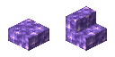

Amethyst Slabs and Stairs are also available. They are crafted with the same recipe as the vanilla slabs and
stairs.

## Stair Wrench
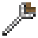

The Stair Wrench is a tool that can be used to rotate stairs. Right-clicking a stair block with the wrench will change
the state of the stairs. Shift-right-clicking will change the 'mode' of the wrench, according to the following modes:

- Facing (North, East, South, West)
- Half (Top, Bottom)
- Shape (Straight, Inner Left, Inner Right, Outer Left, Outer Right)

The mode is saved to each individual wrench and is displayed in the item's tooltip. A turtle can make use of a wrench
by selecting it and using `turtle.place()`.

## Trees

Three new tree types have been added to the game: Sakura Trees, Maple Trees, and Peppy Trees. They currently do not
generate naturally but their saplings can be found in loot chests.

<table>
<thead>
  <tr>
    <th>Sakura Tree</th>
    <th>Maple Tree</th>
    <th>Peppy Tree</th>
  </tr>
</thead>
<tbody>
  <tr>
    <td>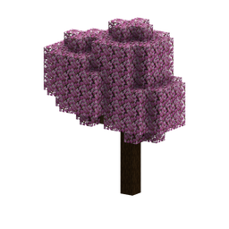</td>
    <td>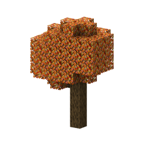</td>
    <td>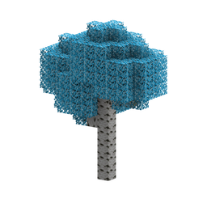</td>
  </tr>
</tbody>
</table>

## Renewable Shulkers

Endermites will rarely bury into Purpur Blocks, similar to how Silverfish bury into stone. When they do, they fuse with
the block, forming a Shulker.

## Dragon Scale
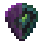

When an Ender Dragon is killed, it will drop a Dragon Scale. The scale can be combined with an Elytra in a crafting
table to create a new Elytra. The old Elytra stays behind untouched, therefore making Elytra cloneable.

## Dyeable Elytra
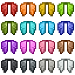

The Elytra can be dyed with any of the 16 dyes by crafting it with the dye. The dye will be consumed in the process.
The original vanilla Elytra can be restored by cleaning it in a cauldron of water.

### Special Elytra

Special dyed variants of the Elytra are also available, and can be crafted with the following recipes:

<table>
  <thead>
    <tr>
      <th>Item</th>
      <th>Recipe (shapeless)</th>
    </tr>
  </thead>
  <tbody>
    <tr>
      <td>
        
      </td>
      <td>
        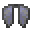
        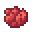
        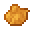
        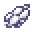
        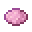
        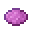
      </td>
    </tr>
    <tr>
      <td>
        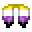
      </td>
      <td>
        
        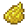
        
        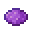
        
      </td>
    </tr>
    <tr>
      <td>
        
      </td>
      <td>
        
        
        
        
        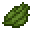
        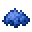
        
      </td>
    </tr>
    <tr>
      <td>
        
      </td>
      <td>
        
        
        
        
      </td>
    </tr>
  </tbody>
</table>

## Soft Toy Sharks
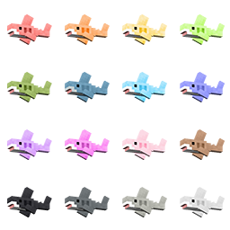

Soft Toy Sharks, also known as BLÅHAJ, are available in all 16 dye colors. They're cuddly to hold.

<div style="display: flex; gap: 16px; align-items: center;">
  
  <p>A special variant of the Soft Toy Shark is also available.</p>
</div>

<div class="clearfix"></div>

## Ancient Tomes
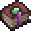

Ancient Tomes are special enchantment books that can an item one level beyond the maximum vanilla level. They are found
in loot chests in Dungeons, Stronghold Libraries, Bastion Remnants, and Woodland Mansions.

Ancient Tomes are available for most (but not all) enchantments:
- Feather Falling (max. V)
- Swift Sneak (max. IV)
- Thorns (max. IV)
- Sharpness (max. VI)
- Smite (max. VI)
- Bane of Arthropods (max. VI)
- Knockback (max. III)
- Fire Aspect (max. III)
- Looting (max. IV)
- Sweeping Edge (max. IV)
- Efficiency (max. VI)
- Unbreaking (max. IV)
- Fortune (max. IV)
- Power (max. VI)
- Punch (max. III)
- Luck of the Sea (max. IV)
- Lure (max. IV)
- Loyalty (max. IV)
- Riptide (max. IV)
- Impaling (max. VI)
- Piercing (max. V)

## Glass Item Frame
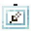

Glass Item Frames are a see-through variant of the vanilla Item Frame. They can be crafted by surrounding an Item Frame
with Glass Panes. Glow Glass Item Frames can be crafted by combining a Glass Item Frame with a Glow Ink Sac.

Glass Item Frames also have special behavior for banners and shields placed inside them.

## Extra Food

<table style="display: table;">
  <thead>
    <tr>
      <th>Item</th>
      <th>Description</th>
    </tr>
  </thead>
  <tbody>
    <tr>
      <td></td>
      <td>
        A bottomless bag of popcorn.
        (<a href="https://github.com/SwitchCraftCC/sc-goodies/issues/4" target="_blank" rel="noopener noreferrer">
          <em>currently unobtainable</em>
        </a>)
      </td>
    </tr>
    <tr>
      <td>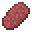</td>
      <td>Yummy salami</td>
    </tr>
    <tr>
      <td>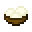</td>
      <td>A delicious treat!</td>
    </tr>
    <tr>
      <td>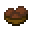</td>
      <td>A delicious treat!</td>
    </tr>
    <tr>
      <td>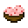</td>
      <td>A delicious treat!</td>
    </tr>
    <tr>
      <td>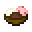</td>
      <td>Vanilla, Chocolate, and Sweet Berry.</td>
    </tr>
    <tr>
      <td>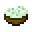</td>
      <td>A refreshing treat!</td>
    </tr>
    <tr>
      <td>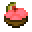</td>
      <td>A delicious treat!</td>
    </tr>
    <tr>
      <td>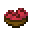</td>
      <td>An earthy treat!</td>
    </tr>
    <tr>
      <td></td>
      <td>A suspiciously familiar sundae.</td>
    </tr>
  </tbody>
</table>
