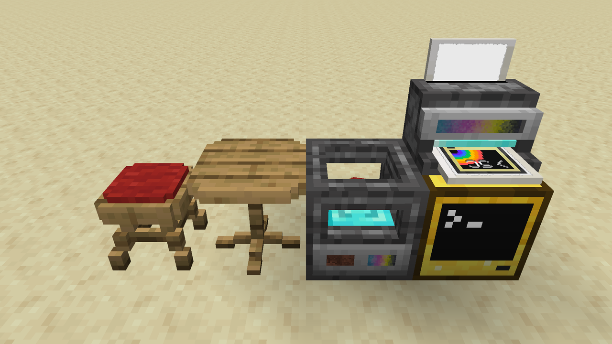
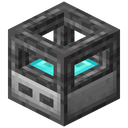
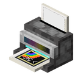

import { Aside } from '@astrojs/starlight/components';

# sc-peripherals
<Aside>
Quick link to .3dm to .3dj converter: https://3dj.lem.sh/
</Aside>

[sc-peripherals](https://github.com/SwitchCraftCC/sc-peripherals) is a Fabric 1.20 
[CC: Tweaked](https://github.com/cc-tweaked/cc-tweaked) peripheral mod for the SwitchCraft server. It adds a 3D printer
in the style of [OpenComputers](https://github.com/MightyPirates/OpenComputers), and a Wide Format Printer that prints 
custom posters to display in item frames.

- `.3dj` models are printed in-game by running `print3d <filename.3dj>` on a computer with a 3D Printer peripheral.
  Legacy OC 3D models can be converted using the [.3dm to .3dj converter](https://3dj.lem.sh).
- `.2dj`/`.2dja` images are printed in-game by running `poster <filename.2dj(a)>` on a computer with a Wide Format Printer
  peripheral.



## Useful links

#### sc-peripherals
- [sc-peripherals on GitHub](https://github.com/project-connecticut/sc-peripherals)

#### 3D Prints
- [OpenComputers .3dm to .3dj converter](https://3dj.lem.sh) (Official)
- [Blockbench plugin for exporting to .3dj](https://www.blockbench.net/plugins/sam3dj) (by [Sammy (1Turtle)](https://github.com/1Turtle))
- [Online Blockbench to .3dj converter](https://3dj.znepb.me) (by [znepb](https://github.com/znepb))
- [SwitchCraft 3D Prints](https://github.com/SwitchCraftCC/3dprints) - Example 3D prints in the style of BiblioCraft

#### Posters
- [Reference image to .2dj converter in Python](https://gist.github.com/SwitchCraft3/e6a59dab9a04807f5d035e4e72720524) (Official)
- [Image to .2dj/.2dja converter](https://poster.madefor.cc/) (by [ShreksHellraiser (MasonGulu)](https://github.com/MasonGulu))
- [Image to .2dj converter written in Rust](https:/github.com/PatriikPlays/img2poster) (by [GPLv3 (PatriikPlays)](https://github.com/PatriikPlays))

## 3D Printer



The 3D Printer is a [peripheral](#peripheral-api---3d-printer) that can be used to print 3D models in-game. It takes
ink cartridges and chamelium to print models, which can be printed with the `print3d` program for files in the `.3dj`
format.

### Differences from OpenComputers

- The 3D Printer and Ink Cartridge are simpler to craft
    - The Ink Cartridge recipe is crafted as a filled cartridge to begin with, but a refill recipe is still provided
- 3D Printers do not require the use of energy
- 3D Printers have externally-visible progress bars for chamelium and ink levels
- First-class ComputerCraft peripheral API support
- `print3d` program included in the ROM by default via a data pack in the mod
    - Printing can be safely terminated by the user, and it will automatically stop after the current item is finished
    - `print3d stop` command to stop a printer via the CLI
    - Uses [3dj format](#3dj-format) instead of 3dm (converter here: https://3dj.lem.sh/)
- Default maximum shape count (configurable) for each state of a print raised from 24 to 128
- The default maximum light level in printed models is now 7 instead of 8 - this is now equivalent to a redstone torch
    - Prints can still be crafted with 8 pieces of glowstone dust to reach maximum brightness level
- 3D prints are waterloggable
- The included "white" texture name changed from `opencomputers:blocks/white` to `sc-peripherals:block/white`
- Print models are more efficiently cached, so chunks with lots of identical prints will only bake the print model once
    - Note that this is not the be-all and end-all of performance, there may still be a lot of vertex data to upload to
      the chunk
- Prints can be crafted with beacon base blocks, honey blocks, and glowstone dust or blocks for additional features.

### .3dj format

The 3dj format was created as a more versatile alternative for processing and storing 3D models compared to the old
OpenComputers 3dm format. It uses JSON instead of Lua tables, so it is easier to work with programmatically.

There is an online .3dm to .3dj converter here: https://3dj.lem.sh/

#### Example

All arguments except for `shapesOff`, `shapesOn`, and `bounds` are optional.

```json
{
  "label": "...",
  "tooltip": "...",
  "isButton": false,
  "collideWhenOn": true,
  "collideWhenOff": true,
  "lightLevel": 0,
  "redstoneLevel": 0,
  "shapesOff": [
    { "bounds": [0, 0, 0, 16, 16, 16], "texture": "", "tint": "FFFFFF" },
    { "bounds": [0, 0, 0, 16, 16, 16], "texture": "", "tint": "FFFFFF" },
    { "bounds": [0, 0, 0, 16, 16, 16], "texture": "", "tint": "FFFFFF" }
  ],
  "shapesOn": [
    { "bounds": [0, 0, 0, 16, 16, 16], "texture": "", "tint": "FFFFFF" }  
  ]
}
```

#### Fields
- `label`: (optional, string) The name of the 3D print, maximum 48 characters.
- `tooltip`: (optional, string) The tooltip of the 3D print in the inventory, maximum 256 characters.
- `isButton`: (optional, boolean) Whether the 3D print acts as a button when right-clicked. If true, the print will
  automatically switch to the 'off' state after 20 ticks when right-clicked. If false, right-clicking will toggle the
  state.
- `collideWhenOff`: (optional, boolean) Whether the 3D print is collidable when in the 'off' state.
- `collideWhenOn`: (optional, boolean) Whether the 3D print is collidable when in the 'on' state.
- `lightLevel`: (optional, number) The light level of the 3D print. Must be between 0 or 15, but values above 7 will
  be clamped to 7 unless the print is later crafted with glowstone dust.
- `lightWhenOff`: (optional, boolean) Whether the 3D print emits light when in the 'off' state.
- `lightWhenOn`: (optional, boolean) Whether the 3D print emits light when in the 'on' state.
- `redstoneLevel`: (optional, number) The redstone level of the 3D print. Must be between 0 or 15.
- `seatPos`: (optional, array of numbers) The position of the seat on the 3D print. If not null or undefined, must be a
  array containing three numbers between 0.1 and 0.9, e.g. `[0.5, 0.5, 0.5]`, where 0.5 is the center of the block. When 
  not null or undefined, the print will be a seat that can be sat on by right-clicking.
- `shapesOff`: (**required**, array of objects) The shapes of the 3D print when in the 'off' state. Each object in the array
  must have a `bounds` property with the bounds of the shape, an optional `texture` property with the texture of the shape,
  and an optional `tint` property with the tint of the shape, which may be a number or a hex string (`RRGGBB`).
  - `bounds`: (**required**, array of numbers) The bounds of the shape, in the format
    `[minX, minY, minZ, maxX, maxY, maxZ]`. Numbers must be between 0 and 16 inclusive (16 is the edge of the block).
  - `texture`: (optional, string) The texture of the shape, including the namespace. For example,
    `minecraft:block/stone` or `sc-peripherals:block/white`. Use the texture analyzer item to find the texture of a
    block in the world. The `sc-peripherals:block/white` texture is available as a blank texture for tinting. If
    texture is not specified or empty string resulting shape is not rendered.
  - `tint`: (optional, number or string) The tint of the shape, as a hex string in the format `RRGGBB`, or a single
    decimal value.
- `shapesOn`: (**required**, array of objects) Same as `shapesOff`, but for the 'on' state. To disallow state changes
  and have no 'on' state, pass an empty array.

#### Differences from 3dm

- Uses JSON instead of Lua tables
- `emitRedstone` renamed to `redstoneLevel`
- `collidable` array is now two separate `collideWhenOff`, `collideWhenOn` boolean fields (default to true)
- `buttonMode` renamed to `isButton`
- `shapes` array has been separated into `shapesOff`, `shapesOn`
    - `state` field removed
    - `tint` in a shape may now be a number or a hex string (`RRGGBB`)

## Wide Format Printer



The Wide Format Printer is a [peripheral](#peripheral-api---wide-format-printer) that can print posters, which are 
map-like items that can be displayed in item frames with custom images. A poster is 128x128 pixels and has a 
customizable 64-color palette (including one transparent color). Like 3D prints, posters can have a custom label and 
tooltip.

The Wide Format Printer requires ink cartridges and paper to print posters.

### .2dj format

A 2dj file is a JSON file with the following structure:

```json
{
  "label":   "...",
  "tooltip": "...", 
  "palette": [],
  "pixels":  [],
  "width":   128,
  "height":  128 
}
```
#### Fields
  
- `label`: (optional) The name of the poster, max 48 characters  
- `tooltip`: (optional) The tooltip of the poster in the inventory, max 256 characters  
- `pallete`: Up to 63 colors encoded as 0xRRGGBB integers, the transparent index 0 should not be included.  
- `pixels`: 16384 (128*128) array of palette indices. 0 is transparent, 1 is the first palette color, etc.  
- `width`: Width of the poster in pixels, not currently used  
- `height`: Height of the poster in pixels, not currently used

Poster palettes are limited to 63 colors plus one transparent color. The first color in the palette (index 0) is
fully transparent, and the remaining 63 colors (index 1 onward) are fully opaque but customizable. By default, the
posters use the same palette as [vanilla maps](https://minecraft.wiki/w/Map_item_format#Base_colors), e.g.
0 is NONE, 1 is <a style='color:rgb(127, 178, 56);'>GRASS</a>, 
2 is <a style='color:rgb(247, 233, 163);'>SAND</a>, etc.

[Example .2dj file](https://p.sc3.io/umAmBHM3p2)

### .2dja format

A 2dja file is primarily a collection of 2dj files, encoded with the following structure:

```json
{
  "title": "...",
  "width": 1,     
  "height": 3,    
  "pages": [      
    {  },
    {  },
    {  }
  ]
}
```
#### Fields
`title`: (optional) The name of the collection of posters, not currently used  
`width`: (optional) Count of posters in a row, not currently used  
`height`: (optional) Count of posters in a column, not currently used  
`pages`: Array of 2dj files, length should be width * height if specified  

## Peripheral API - 3D Printer

A 3D Printer can be wrapped as a peripheral with the name `3d_printer`, e.g.:

```lua
local printer = peripheral.wrap("3d_printer")
```

The 3D Printer has a local buffer of what to print, referred to here as the "model". A model has two shape sets
(collections of "shapes", which are cuboids with a texture and tint), a set for the "on" state and a set for the "off" state. After adding
the shapes to the model 
with [`printer.addShape(...)`](#printeraddshapeminxnumber-minynumber-minznumber-maxxnumber-maxynumber-maxznumber-texturestring-stateboolean-tintnumber) 
or [`printer.addShapes({ ... })`](#printeraddshapesshapestable) (recommended), it can be printed by committing it 
with [`printer.commit(count)`](#printercommitcountnumber-boolean). 

The printer will remember the model, so subsequent copies can be printed by committing again, or a new model can be
printed by resetting the printer with [`printer.reset()`](#printerreset).

The two shape sets (off and on) have a limit of 128 shapes each, for a total of 256 shapes per model. The default state 
is "off". 

<Aside>
For a practical example of the 3D Printer API, refer to the built-in 
[print3d program](https://github.com/SwitchCraftCC/sc-peripherals/blob/HEAD/src/main/resources/data/computercraft/lua/rom/programs/print3d.lua).
</Aside>

### `printer.addShape(minX:number, minY:number, minZ:number, maxX:number, maxY:number, maxZ:number[, texture:string[, state:boolean[, tint:number]]])`


<Aside type="caution">
Using [`printer.addShapes`](#printeraddshapesshapestable) is preferred as it is significantly faster. Each individual
`addShape` call will take at least 1 tick.
</Aside>

Adds a single shape (cuboid) to the model. The shape dimensions must be between 0 and 16 (inclusive) and the shape must 
not have a volume of 0. A maximum of 128 shapes can be added to a shape set.

#### Parameters

| Param     | Type                 | Description                                                                                                                                                                                                    |
|-----------|----------------------|----------------------------------------------------------------------------------------------------------------------------------------------------------------------------------------------------------------|
| `minX`    | `number`             | The minimum X coordinate of this shape, between 0 and 16 (inclusive)                                                                                                                                           |
| `minY`    | `number`             | The minimum Y coordinate of this shape, between 0 and 16 (inclusive)                                                                                                                                           |
| `minZ`    | `number`             | The minimum Z coordinate of this shape, between 0 and 16 (inclusive)                                                                                                                                           |
| `maxX`    | `number`             | The maximum X coordinate of this shape, between 0 and 16 (inclusive)                                                                                                                                           |
| `maxY`    | `number`             | The maximum Y coordinate of this shape, between 0 and 16 (inclusive)                                                                                                                                           |
| `maxZ`    | `number`             | The maximum Z coordinate of this shape, between 0 and 16 (inclusive)                                                                                                                                           |
| `texture` | `string` (optional)  | The texture identifier of this shape. Must be in the format `modid:path/texture`, e.g. `minecraft:block/sandstone`. You can right-click on any block with a Texture Analyzer to find the name of its textures. |
| `state`   | `boolean` (optional) | The shape set to put this shape in, `false` for the "off" state and `true` for the "on" state. Defaults to `false`.                                                                                            |
| `tint`    | `number` (optional)  | The color to tint this shape. Must be of the form `0xRRGGBB`. Defaults to `0xFFFFFF` (white).                                                                                                                  |

### `printer.addShapes(shapes:table)`

Adds multiple shapes to the model. The shapes may be added to either shape set (or both in one batch) by specifying the
`state` parameter. A maximum of 128 shapes can be added to a shape set, and 256 shapes to the model as a whole.

A shape passed to this function is a mixed table, where the first 6 elements are numbers are the bounds of the shape,
and `texture`, `state` and `tint` may be provided as named keys.

An example shapes table:

```lua
local shapes = {
  -- Off state
  { 0, 0, 0, 16, 8,  16, texture = "minecraft:block/stone",     state = false, tint = 0xFF0000 },
  { 0, 8, 0, 16, 16, 16, texture = "minecraft:block/sandstone", state = false, tint = 0xFFFFFF },
  -- On state
  { 0, 0, 0, 16, 8,  16, texture = "minecraft:block/stone",     state = true,  tint = 0x0000FF },
  { 0, 8, 0, 16, 16, 16, texture = "minecraft:block/sandstone", state = true,  tint = 0xFFFFFF },
}
```

#### Shape table parameters

| Param     | Type                 | Description                                                                                                                                                                                                    |
|-----------|----------------------|----------------------------------------------------------------------------------------------------------------------------------------------------------------------------------------------------------------|
| 1         | `number`             | The minimum X coordinate of this shape, between 0 and 16 (inclusive)                                                                                                                                           |
| 2         | `number`             | The minimum Y coordinate of this shape, between 0 and 16 (inclusive)                                                                                                                                           |
| 3         | `number`             | The minimum Z coordinate of this shape, between 0 and 16 (inclusive)                                                                                                                                           |
| 4         | `number`             | The maximum X coordinate of this shape, between 0 and 16 (inclusive)                                                                                                                                           |
| 5         | `number`             | The maximum Y coordinate of this shape, between 0 and 16 (inclusive)                                                                                                                                           |
| 6         | `number`             | The maximum Z coordinate of this shape, between 0 and 16 (inclusive)                                                                                                                                           |
| `texture` | `string` (optional)  | The texture identifier of this shape. Must be in the format `modid:path/texture`, e.g. `minecraft:block/sandstone`. You can right-click on any block with a Texture Analyzer to find the name of its textures. |
| `state`   | `boolean` (optional) | The shape set to put this shape in, `false` for the "off" state and `true` for the "on" state. Defaults to `false`.                                                                                            |
| `tint`    | `number` (optional)  | The color to tint this shape. Must be of the form `0xRRGGBB`. Defaults to `0xFFFFFF` (white).                                                                                                                  |

### `printer.commit(count:number): boolean`

Asynchronously begins printing the specified number of prints. 

`count` must be greater than 0. Once a job has been committed, the printer will continue trying to print that number of
items even if it runs out of ink or chamelium - it will simply wait for more resources to be added. If there is a
different print in the printer's output slot, the job will still be committed, but printing will not begin until the
other item is removed.

### `printer.getButtonMode(): boolean`

Returns whether this print model is in button mode. This can be changed with 
[`printer.setButtonMode()`](#printersetbuttonmodeisbuttonboolean).

### `printer.getChameliumLevel(): number, number`

Returns the amount of chamelium currently in the printer, and the maximum amount of chamelium the printer can store
(currently 256000).

### `printer.getInkLevel(): number, number`

Returns the amount of ink currently in the printer, and the maximum amount of ink the printer can store
(currently 100000).

### `printer.getLabel(): string`

Returns the label of this print model (the name shown on the item). This can be changed with
[`printer.setLabel()`](#printersetlabellabelstring).

### `printer.getLightLevel(): number`

Returns the light level of this print model. On the model, this will be between 0 and 7 (inclusive). This can be changed
with [`printer.setLightLevel()`](#printersetlightlevellevelnumber). Higher light levels can be achieved by crafting 
the resulting print with glowstone dust.

### `printer.getMaxShapeCount(): number`

Returns the maximum shape count per shape set (128).

### `printer.getRedstoneLevel(): number`

Returns the light level of this print model. This will be between 0 and 15 (inclusive). This can be changed
with [`printer.setRedstoneLevel()`](#printersetredstonelevellevelnumber).

### `printer.getShapeCount(): number, number`

Returns the number of shapes for the "off" shape set and the "on" shape set, respectively.

### `printer.getTooltip(): string`

Returns the tooltip (description) of the print item.

### `printer.isCollidable(): boolean, boolean`

Returns whether print model is collidable in the "off" state and "on" state respectively.

### `printer.reset()`

Resets the current print buffer to start a new shape. Does not stop any ongoing print jobs.

### `printer.setButtonMode(isButton:boolean)`

Sets whether the print model is in button mode.

### `printer.setCollidable(collideWhenOff:boolean, collideWhenOn:boolean)`

Sets whether the print model is collidable in the "off" state and "on" state respectively.

### `printer.setLabel([label:string])`

Sets the label (item name) of the print item.

### `printer.setLightLevel(level:number)`

Sets the light level of the print model. This must be between 0 and 7 (inclusive). Higher light levels can be achieved 
by crafting the resulting print with glowstone dust.

### `printer.setRedstoneLevel(level:number)`

Sets the redstone level of the print model. This must be between 0 and 15 (inclusive).

### `printer.setStateLighting(lightWhenOff:boolean, lightWhenOn:boolean)`

Sets whether the print model is emitting light in the "off" state and "on" state respectively.

### `printer.getSeatPos(): number, number, number`

Returns the position of the seat on the print model. If the print model is not a seat, this will return `nil, nil, nil`.

### `printer.setSeatPos(x:number, y:number, z:number)`
Sets the position of the seat on the print model. The positions must be between 0.1 and 0.9 for each axis, or `nil` to
remove the seat.

### `printer.setTooltip([tooltip:string])`

Sets the tooltip (description) of the print item.

### `printer.status(): string, number|boolean`

Returns the status and print progress of the printer.

#### Returned parameters

| Param      | Type                  | Description                                                                                                                                                                                                                   |
|------------|-----------------------|-------------------------------------------------------------------------------------------------------------------------------------------------------------------------------------------------------------------------------|
| `status`   | `string`              | <ul><li>`busy` - The printer is currently printing an item.</li><li>`idle` - The printer is not currently printing anything.</li></ul>                                                                                        |
| `progress` | `number` or `boolean` | If the printer is `busy`, then the progress of the *current item* in ticks, between 0 and 100 (5 seconds).<br />If the printer is `idle`, then `true` if it is ready to print (output slot is not blocked) or `false` if not. |


### `printer.stop()`

Requests the printer to stop the print job after the current item.

### `3d_printer_state` event

The `3d_printer_state` event is emitted whenever a print job starts, stops, or the print model is changed.

#### Parameters

| Param    | Type     | Description                                                                                                    |
|----------|----------|----------------------------------------------------------------------------------------------------------------|
| `status` | `string` | The current print status, see [`printer.status()`](#printerstatus-string-numberboolean) for possible values. |

### `3d_printer_complete` event

The `3d_printer_complete` event is emitted when a print item has been printed, i.e. once for each `count` in a committed
print job.

#### Parameters

| Param       | Type     | Description                                     |
|-------------|----------|-------------------------------------------------|
| `remaining` | `number` | The number of items remaining in the print job. |


## Peripheral API - Wide Format Printer

A Wide Format Printer can be wrapped as a peripheral with the name `poster_printer`, e.g.:

```lua
local posterPrinter = peripheral.wrap("poster_printer")
```

The Wide Format Printer has a local buffer of what to print, referred to here as the "poster". A poster has a table of 
palette colors (63 colors, as index 0 is always transparent) and a table of pixels (16384 entries, 128*128). After
blitting pixels to the poster with 
[`posterPrinter.blitPixels(...)`](#posterprinterblitpixelsxnumber-ynumber-pixelstable) and setting the palette with
[`posterPrinter.blitPalette(...)`](#posterprinterblitpalettepalettetable), the poster can be printed with 
[`posterPrinter.commit(count)`](#posterprintercommitcountnumber-boolean).

The printer will remember the poster data, so subsequent copies can be printed by committing again, or a new poster can
be printed by resetting the printer with [`posterPrinter.reset()`](#posterprinterreset).

<Aside>
For a practical example of the Wide Format Printer API, refer to the built-in [poster program](https://github.com/SwitchCraftCC/sc-peripherals/blob/HEAD/src/main/resources/data/computercraft/lua/rom/programs/poster.lua).
</Aside>

### `posterPrinter.setPixel(x:number, y:number, color:number)`


<Aside type="caution">
Using [`posterPrinter.blitPixels`](#posterprinterblitpixelsxnumber-ynumber-pixelstable) is preferred as it is significantly faster. Each individual `setPixel` call will take at least 1 tick.
</Aside>

Sets the color of a single pixel in the poster. The color refers to the palette index and must be between 0 and 63 
(inclusive). Palette index 0 is always transparent. The pixel coordinates must be between 1 and 128 (inclusive).

### `posterPrinter.blitPixels(x:number, y:number, pixels:table)`

Sets multiple pixels in the poster. The pixels table must be a one-dimensional table of pixel colors, of maximum size
16384 (128 * 128). The pixel colors refer to the palette index and must be between 0 and 63 (inclusive). Palette index 0 
is always transparent.

Pixels will wrap onto the next row (starting at `x` = 1) if the table is larger than the remaining space in the row. 
This means you can set the entire poster at once by calling `blitPixels(1, 1, pixels)`, where `pixels` is a table of 
16384 entries.

### `posterPrinter.setPaletteColor(index:number, red:number, green:number, blue:number)`

<Aside type="caution">
Using [`posterPrinter.blitPalette`](#posterprinterblitpalettepalettetable) is preferred as it is significantly
faster. Each individual `setPaletteColor` call will take at least 1 tick.
</Aside>

Sets a single color in the poster palette. The palette index must be between 1 and 63 (inclusive). The color components
must be between 0 and 255 (inclusive). Palette index 0 is always transparent, and cannot be changed.

### `posterPrinter.blitPalette(palette:table)`

Sets the palette of the poster. The palette table must be a one-dimensional table of colors, of maximum size 63. The
first entry in the table is index 1, as index 0 is always transparent. This means you can pass a one-indexed Lua table
directly as a palette. A color is represented as a 24-bit integer, where the first 8 bits are the red component, the 
next 8 bits are the green component, and the last 8 bits are the blue component. For example, `0xFF0000` is red, 
`0x00FF00` is green, and `0x0000FF` is blue.

Example:

```lua
posterPrinter.blitPalette({
    0xFF0000, -- idx 1, Red
    0x00FF00, -- idx 2, Green
    0x0000FF, -- idx 3, Blue
    -- ... up to 63 entries
})
```

### `posterPrinter.commit(count:number): boolean`

Asynchronously begins printing the specified number of posters.

`count` must be greater than 0. Once a job has been committed, the printer will continue trying to print that number of
items even if it runs out of ink or paper - it will simply wait for more resources to be added. If there is a
different poster in the printer's output slot, the job will still be committed, but printing will not begin until the
other item is removed.

### `posterPrinter.getInkLevel(): number, number`

Returns the amount of ink currently in the printer, and the maximum amount of ink the printer can store
(currently 100000).

### `posterPrinter.getLabel(): string`

Returns the label of this poster item (the name shown on the item). This can be changed with
[`posterPrinter.setLabel()`](#posterprintersetlabellabelstring).

### `posterPrinter.getTooltip(): string`

Returns the tooltip (description) of the poster item.

### `posterPrinter.reset()`

Resets the current print buffer to start a new poster. Does not stop any ongoing print jobs.

### `posterPrinter.setLabel([label:string])`

Sets the label (item name) of the poster item.

### `posterPrinter.setTooltip([tooltip:string])`

Sets the tooltip (description) of the poster item.

### `posterPrinter.status(): string, number|boolean`

Returns the status and print progress of the printer.

#### Returned parameters

| Param      | Type                  | Description                                                                                                                                                                                                                   |
|------------|-----------------------|-------------------------------------------------------------------------------------------------------------------------------------------------------------------------------------------------------------------------------|
| `status`   | `string`              | <ul><li>`busy` - The printer is currently printing an item.</li><li>`idle` - The printer is not currently printing anything.</li></ul>                                                                                        |
| `progress` | `number` or `boolean` | If the printer is `busy`, then the progress of the *current item* in ticks, between 0 and 100 (5 seconds).<br />If the printer is `idle`, then `true` if it is ready to print (output slot is not blocked) or `false` if not. |


### `posterPrinter.stop()`

Requests the printer to stop the print job after the current item.

### `poster_printer_state` event

The `poster_printer_state` event is emitted whenever a print job starts, stops, or the poster data is changed.

#### Parameters

| Param    | Type     | Description                                                                                                                |
|----------|----------|----------------------------------------------------------------------------------------------------------------------------|
| `status` | `string` | The current print status, see [`posterPrinter.status()`](#posterprinterstatus-string-numberboolean) for possible values. |

### `poster_printer_complete` event

The `poster_printer_complete` event is emitted when a poster item has been printed, i.e. once for each `count` in a 
committed print job.

#### Parameters

| Param       | Type     | Description                                     |
|-------------|----------|-------------------------------------------------|
| `remaining` | `number` | The number of items remaining in the print job. |
